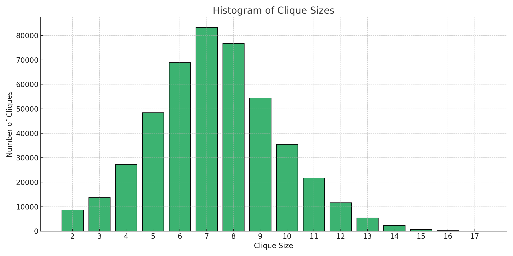
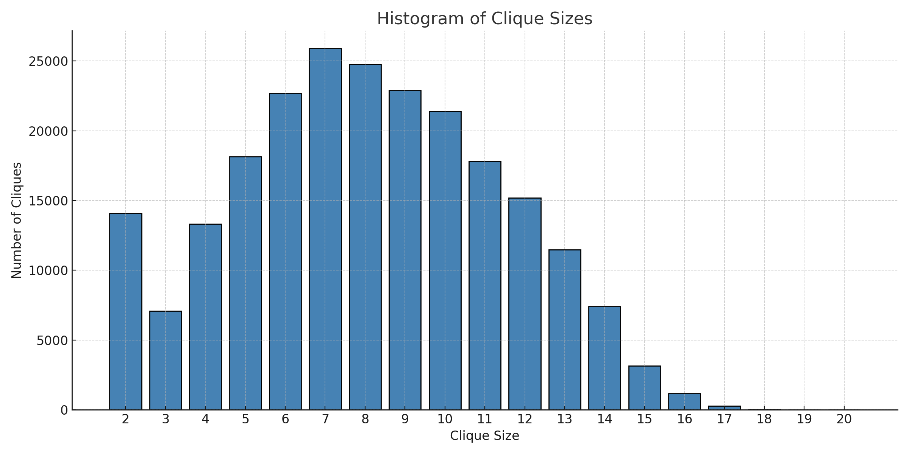
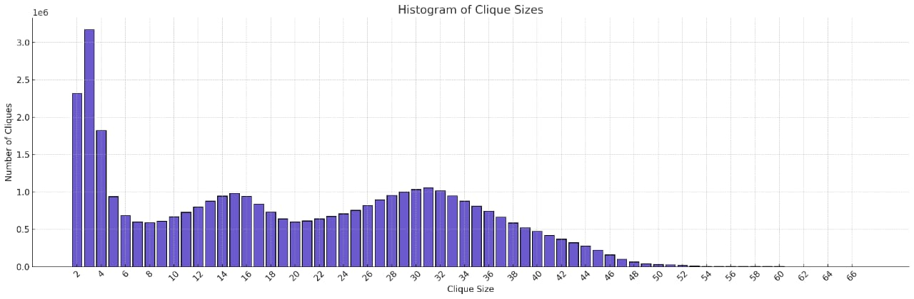

# DAA Assignment - 1

## Group Members
- Priyansh Agarwal(2022A7PS1293H)
- Harsh Jawajiwar (2021B5A72358H)
- Ansh Kalucha(2022A7PS1799H)
- Sarthak Somani(2021B1A70793H)
- Ujjwal Mishra(2021B72479H)

---
Three graph algorithms' C/C++ implementations are included in this repository, along with experimental findings from three datasets.  The `-O3` flag has been used to optimize the algorithms.  The study includes thorough explanations of the algorithms and experimental findings.

---


## Dataset Preparation

1. **Download the Datasets:**

   - [Email-Enron dataset](https://snap.stanford.edu/data/email-Enron.html)
   - [AS-Skitter dataset](https://snap.stanford.edu/data/as-Skitter.html)
   - [Wiki-Vote dataset](https://snap.stanford.edu/data/wiki-Vote.html)

2. **Extract and Organize Files:**

   - Download the ZIP file for each dataset.
   - Unzip each file.
   - Locate the text file containing the graph data from each dataset.

3. **Place and Rename Files:**

   - Move the text files into the `code` directory.
   - Rename the files as follows:
     - Enron dataset → `Email-Enron.txt`
     - Wiki-Vote dataset → `wiki-Vote.txt`
     - AS-Skitter dataset → `as-skitter.txt`

4. **File Format Adjustments:**

   - **Remove Comments:**  
     Remove any comments at the top of each file.
     
   - **Set Header Format:**  
     
     For example, for `wiki-Vote.TXT`, the file should begin with a line similar to:
     ```
     6688    93689
     ```
     followed by the list of edges:
     ```
     320    1412
     153    242
     ...
     ```
    The actual node and edge values are provided in the original TXT file.
---
   ## Compilation Instructions


1. **Modify Dataset File Names in Source Files:**

   - **ELS Algorithm (`els.cpp`):**
     - Open `els.cpp` and go to **line 273**.
     - Change the dataset file name to one of: `as-skitter.txt`, `Email-Enron.txt`, or `wiki-Vote.txt` as needed.
     
   - **Tomita Algorithm (`worst-case.cpp`):**
     - Open `worst-case.cpp` and go to **line 115**.
     - Change the dataset file name to one of: `as-skitter.txt`, `Email-Enron.txt`, or `wiki-Vote.txt` as needed.
     
   - **Chiba Algorithm (`chiba.cpp`):**
     - Open `chiba.cpp` and go to **line 146**.
     - Change the dataset file name to one of: `as-skitter.txt`, `Email-Enron.txt`, or `wiki-Vote.txt` as needed.

2. **Compile the Source Files with g++:**

   Use the `-O3` optimization flag when compiling:

   - Compile `els.cpp`:
     ```bash
     g++ -O3 -o els els.cpp
     els.exe (Windows)
     ./els.exe (Unix)
     ```
   - Compile `worst-case.cpp`:
     ```bash
     g++ -O3 -o worst-case worst-case.cpp
     tomita.exe (Windows)
     ./tomita.exe (Unix)
     ```
   - Compile `chiba.cpp`:
     ```bash
     g++ -O3 -o chiba chiba.cpp
     chiba.exe (Windows)
     ./chiba.exe (Unix)
     ```
---

## Individual Contributions

- **Priyansh Agarwal & Ansh Kalucha**  
  - Developed the worst-case time complexity for generating all maximal cliques and computational experiments by Etsuji Tomitaa, Akira Tanakaa and Haruhisa Takahashi

- **Sarthak Somani**  
  - Developed the Arboricity and Subgraph Listing Algorithms by Norishige Chiba and Takao Nishizekvf

- **Ujjwal Mishra & Harsh Jawajiwar**  
  - Developed the Listing All Maximal Cliques in Sparse Graphs in Near-optimal Time Algorithm by David Eppstein, Maarten Loffler, and Darren Strash
  - Created the project webpage.
## 1. Chiba Implementation

### Overview
The Chiba implementation is based on the Bron-Kerbosch algorithm, which is a well-known algorithm for finding all maximal cliques in an undirected graph. The algorithm uses a recursive backtracking approach to explore all possible cliques in the graph.

### Key Features
- **Graph Representation**: The graph is represented using an adjacency list, where each vertex maintains a set of its neighbors. This allows for efficient neighbor lookups.
- **Recursive Backtracking**: The algorithm uses a recursive function `expand` to explore all possible cliques. It maintains three sets:
  - **R**: The current clique being constructed.
  - **P**: The set of candidate vertices that can be added to the clique.
  - **X**: The set of vertices that have already been processed and should not be considered again.
- **Maximal Clique Detection**: A clique is maximal when both P and X are empty, meaning no more vertices can be added to the current clique.
- **Output**: The algorithm writes the maximal cliques to an output file and also maintains a histogram of clique sizes.

### Algorithm Steps
1. **Initialization**: Start with an empty clique R, all vertices in P, and an empty X.
2. **Recursive Expansion**:
   - For each vertex in P, add it to R and recursively explore its neighbors.
   - Update P and X by intersecting them with the neighbors of the current vertex.
   - If P and X are empty, the current R is a maximal clique.
3. **Backtracking**: After exploring a vertex, remove it from P and add it to X to avoid reprocessing.

### Performance Considerations
- **Time Complexity**: The worst-case time complexity of the Bron-Kerbosch algorithm is O(3^(n/3)), where n is the number of vertices. This is because the algorithm explores all possible cliques in the graph.
- **Space Complexity**: The space complexity is O(n + m), where n is the number of vertices and m is the number of edges, due to the adjacency list representation.
- **Optimization**: The algorithm does not use any pivot selection, which could improve performance by reducing the number of recursive calls.

### Output
The algorithm outputs the maximal cliques to a file, along with a histogram of clique sizes and the total number of maximal cliques. It also measures and outputs the time taken to find all cliques.

---

## 2. ELS Implementation

### Overview
The ELS implementation is also based on the Bron-Kerbosch algorithm, but it uses a pivot-based optimization known as the Tomita algorithm. This optimization reduces the number of recursive calls by selecting a pivot vertex with the highest degree, which helps prune the search space.

### Key Features
- **Graph Representation**: Similar to the Chiba implementation, the graph is represented using an adjacency list.
- **Pivot Selection**: The algorithm selects a pivot vertex with the maximum degree from the union of P and X. This pivot is used to reduce the number of recursive calls by skipping vertices that are neighbors of the pivot.
- **Recursive Backtracking**: The algorithm uses a recursive function `tomita` to explore cliques, maintaining the same sets R, P, and X as in the Chiba implementation.
- **Output**: The algorithm writes the maximal cliques to an output file and maintains a histogram of clique sizes.

### Algorithm Steps
1. **Initialization**: Start with an empty clique R, all vertices in P, and an empty X.
2. **Pivot Selection**: Select a pivot vertex with the highest degree from P and X.
3. **Recursive Expansion**:
   - For each vertex in P that is not a neighbor of the pivot, add it to R and recursively explore its neighbors.
   - Update P and X by intersecting them with the neighbors of the current vertex.
   - If P and X are empty, the current R is a maximal clique.
4. **Backtracking**: After exploring a vertex, remove it from P and add it to X.

### Performance Considerations
- **Time Complexity**: The pivot-based optimization reduces the number of recursive calls, but the worst-case time complexity remains O(3^(n/3)). However, in practice, the pivot selection can significantly improve performance.
- **Space Complexity**: The space complexity is O(n + m), similar to the Chiba implementation.
- **Optimization**: The pivot selection is the key optimization in this implementation, which helps prune the search space and reduce redundant computations.

### Output
The algorithm outputs the maximal cliques to a file, along with a histogram of clique sizes and the total number of maximal cliques. It also measures and outputs the time taken to find all cliques.

---

## 3. Worst-Case Implementation

### Overview
The Worst-Case implementation is another variant of the Bron-Kerbosch algorithm, but it is designed to handle the worst-case scenario where the graph is dense, and the number of maximal cliques is exponential. This implementation also uses the Tomita algorithm with pivot selection.

### Key Features
- **Graph Representation**: The graph is represented using an adjacency list, similar to the other implementations.
- **Pivot Selection**: The algorithm selects a pivot vertex with the highest degree from P and X, similar to the ELS implementation.
- **Recursive Backtracking**: The algorithm uses a recursive function `tomita` to explore cliques, maintaining the same sets R, P, and X.
- **Output**: The algorithm outputs the maximal cliques to a file, along with a histogram of clique sizes and the total number of maximal cliques.

### Algorithm Steps
1. **Initialization**: Start with an empty clique R, all vertices in P, and an empty X.
2. **Pivot Selection**: Select a pivot vertex with the highest degree from P and X.
3. **Recursive Expansion**:
   - For each vertex in P that is not a neighbor of the pivot, add it to R and recursively explore its neighbors.
   - Update P and X by intersecting them with the neighbors of the current vertex.
   - If P and X are empty, the current R is a maximal clique.
4. **Backtracking**: After exploring a vertex, remove it from P and add it to X.

### Performance Considerations
- **Time Complexity**: The worst-case time complexity is O(3^(n/3)), similar to the other implementations. However, the pivot selection helps reduce the number of recursive calls in practice.
- **Space Complexity**: The space complexity is O(n + m), due to the adjacency list representation.
- **Optimization**: The pivot selection is the key optimization, which helps prune the search space and reduce redundant computations.

### Output
The algorithm outputs the maximal cliques to a file, along with a histogram of clique sizes and the total number of maximal cliques. It also measures and outputs the time taken to find all cliques.

---

## Comparison of the Three Implementations

| Feature                  | Chiba Implementation       | ELS Implementation         | Worst-Case Implementation |
|--------------------------|---------------------------|---------------------------|---------------------------|
| Algorithm                | Bron-Kerbosch             | Tomita (Bron-Kerbosch + Pivot) | Tomita (Bron-Kerbosch + Pivot) |
| Pivot Selection          | No                        | Yes                       | Yes                       |
| Graph Representation     | Adjacency List            | Adjacency List            | Adjacency List            |
| Time Complexity          | O(m⋅α(G))                 | O(dn3^(d/3))              | O(3^(n/3))                |
| Space Complexity         | O(n + m)                  | O(n + m)                  | O(n + m)                  |
| Optimization             | Degree-based ordering     | Pivot Selection,Degree-based ordering          | Pivot Selection           |
| Output                   | Cliques, Histogram, Time  | Cliques, Histogram, Time  | Cliques, Histogram, Time  |

---

## Theoretical Analysis

### Bron-Kerbosch Algorithm
- The Bron-Kerbosch algorithm is a classic algorithm for finding all maximal cliques in a graph. It uses a recursive backtracking approach to explore all possible cliques.
- The algorithm is efficient for sparse graphs but can be slow for dense graphs due to its exponential time complexity.

### Tomita Algorithm (Pivot-Based Optimization)
- The Tomita algorithm is an optimized version of the Bron-Kerbosch algorithm that uses pivot selection to reduce the number of recursive calls.
- The algorithm prunes the search space and avoids redundant computations by selecting a pivot vertex with the highest degree.
- This optimization is particularly useful for dense graphs, where the number of maximal cliques can be very large.

### Performance in Practice
- The Chiba implementation (without pivot selection) is simpler but may perform poorly on dense graphs.
- The ELS and Worst-Case implementations (with pivot selection) are more efficient in practice, especially for dense graphs, due to the pivot-based optimization.

### Output and Usability
- All three implementations provide detailed output, including the maximal cliques, a histogram of clique sizes, and the time taken to find the cliques.
- This makes them suitable for both theoretical analysis and practical applications.

---

## Conclusion
- The Chiba implementation is a straightforward implementation of the Bron-Kerbosch algorithm without any optimizations. It is suitable for small graphs or sparse graphs but may struggle with dense graphs.
- The ELS and Worst-Case implementations use the Tomita algorithm with pivot selection, making them more efficient for dense graphs. They are better suited for real-world applications where the graph may be large and dense.
- All three implementations provide detailed output, making them useful for both theoretical analysis and practical applications. However, the ELS and Worst-Case implementations are generally preferred due to their pivot-based optimizations.

---

## Results and Discussion

### wiki-Vote
- Total number of maximal cliques: 459002
- Largest Clique size: 17
- Time taken by :
--  Chiba:
--  ELS:
--  Wrost-Case: 
- **Clique Size Distribution**:
  - Size 2: 8655 cliques
  - Size 3: 13718 cliques
  - Size 4: 27292 cliques
  - Size 5: 48416 cliques
  - Size 6: 68872 cliques
  - Size 7: 83266 cliques
  - Size 8: 76732 cliques
  - Size 9: 54456 cliques
  - Size 10: 35470 cliques
  - Size 11: 21736 cliques
  - Size 12: 11640 cliques
  - Size 13: 5449 cliques
  - Size 14: 2329 cliques
  - Size 15: 740 cliques
  - Size 16: 208 cliques
  - Size 17: 23 cliques



---

### Email-Enron
- Total number of maximal cliques: 226859
- Largest Clique size: 20
- Time taken by :
  -   Chiba:
  -   ELS:
  -   Wrost-Case:
- **Clique Size Distribution**:
  - Size 2: 14070 cliques
  - Size 3: 7077 cliques
  - Size 4: 13319 cliques
  - Size 5: 18143 cliques
  - Size 6: 22715 cliques
  - Size 7: 25896 cliques
  - Size 8: 24766 cliques
  - Size 9: 22884 cliques
  - Size 10: 21393 cliques
  - Size 11: 17833 cliques
  - Size 12: 15181 cliques
  - Size 13: 11487 cliques
  - Size 14: 7417 cliques
  - Size 15: 3157 cliques
  - Size 16: 1178 cliques
  - Size 17: 286 cliques
  - Size 18: 41 cliques
  - Size 19: 10 cliques
  - Size 20: 6 cliques



---
### as-Skitter
- Total number of maximal cliques: 37322355
- Largest Clique size: 67
- - Time taken by :
-   Chiba:
-   ELS:
-   Wrost-Case:
- **Clique Size Distribution**:
   - Size 2: 2319807 cliques
   - Size 3: 3171609 cliques
   - Size 4: 1823321 cliques
   - Size 5: 939336 cliques
   - Size 6: 684873 cliques
   - Size 7: 598284 cliques
   - Size 8: 588889 cliques
   - Size 9: 608937 cliques
   - Size 10: 665661 cliques
   - Size 11: 728098 cliques
   - Size 12: 798073 cliques
   - Size 13: 877282 cliques
   - Size 14: 945194 cliques
   - Size 15: 980831 cliques
   - Size 16: 939987 cliques
   - Size 17: 839330 cliques
   - Size 18: 729601 cliques
   - Size 19: 639413 cliques
   - Size 20: 600192 cliques
   - Size 21: 611976 cliques
   - Size 22: 640890 cliques
   - Size 23: 673924 cliques
   - Size 24: 706753 cliques
   - Size 25: 753633 cliques
   - Size 26: 818353 cliques
   - Size 27: 892719 cliques
   - Size 28: 955212 cliques
   - Size 29: 999860 cliques
   - Size 30: 1034106 cliques
   - Size 31: 1055653 cliques
   - Size 32: 1017560 cliques
   - Size 33: 946717 cliques
   - Size 34: 878552 cliques
   - Size 35: 809485 cliques
   - Size 36: 744634 cliques
   - Size 37: 663650 cliques
   - Size 38: 583922 cliques
   - Size 39: 520239 cliques
   - Size 40: 474301 cliques
   - Size 41: 420796 cliques
   - Size 42: 367879 cliques
   - Size 43: 321829 cliques
   - Size 44: 275995 cliques
   - Size 45: 222461 cliques
   - Size 46: 158352 cliques
   - Size 47: 99522 cliques
   - Size 48: 62437 cliques
   - Size 49: 39822 cliques
   - Size 50: 30011 cliques
   - Size 51: 25637 cliques
   - Size 52: 17707 cliques
   - Size 53: 9514 cliques
   - Size 54: 3737 cliques
   - Size 55: 2042 cliques
   - Size 56: 1080 cliques
   - Size 57: 546 cliques
   - Size 58: 449 cliques
   - Size 59: 447 cliques
   - Size 60: 405 cliques
   - Size 61: 283 cliques
   - Size 62: 242 cliques
   - Size 63: 146 cliques
   - Size 64: 84 cliques
   - Size 65: 49 cliques
   - Size 66: 22 cliques
   - Size 67: 4 cliques
 
     
 
